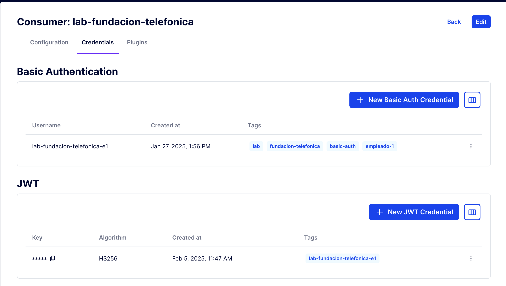
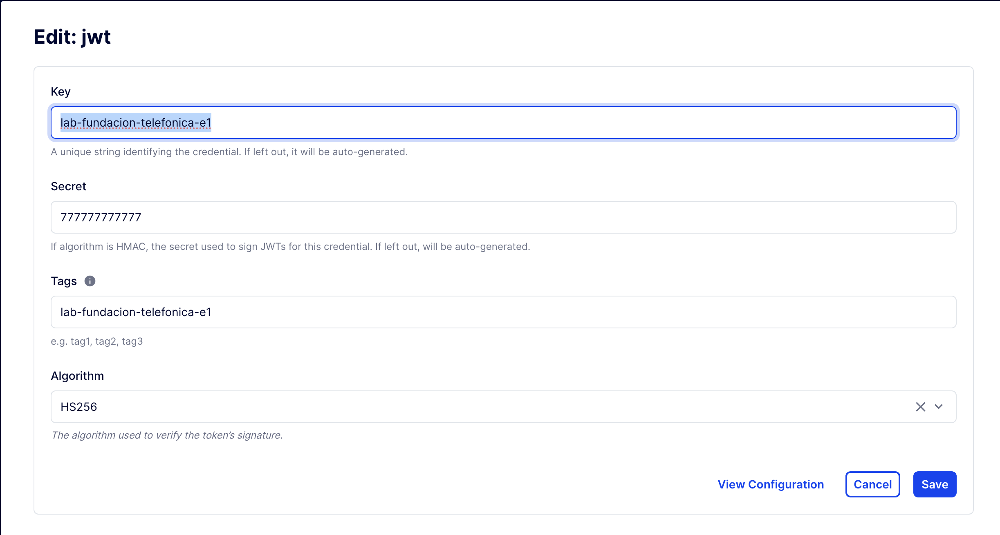
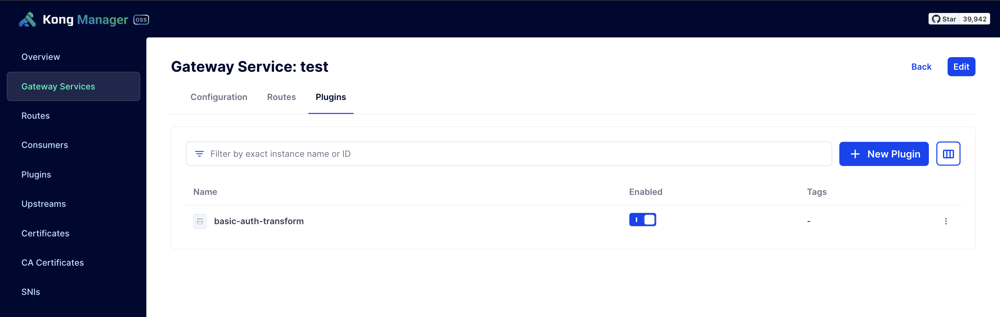
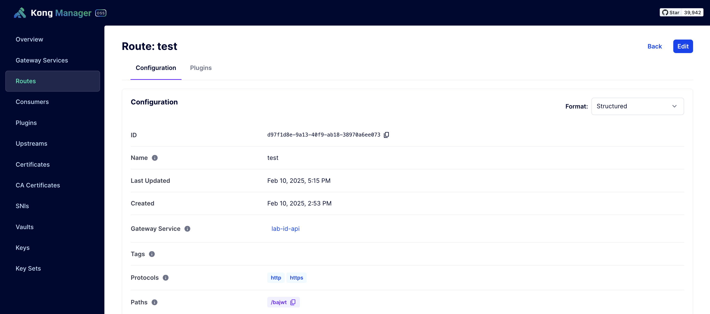
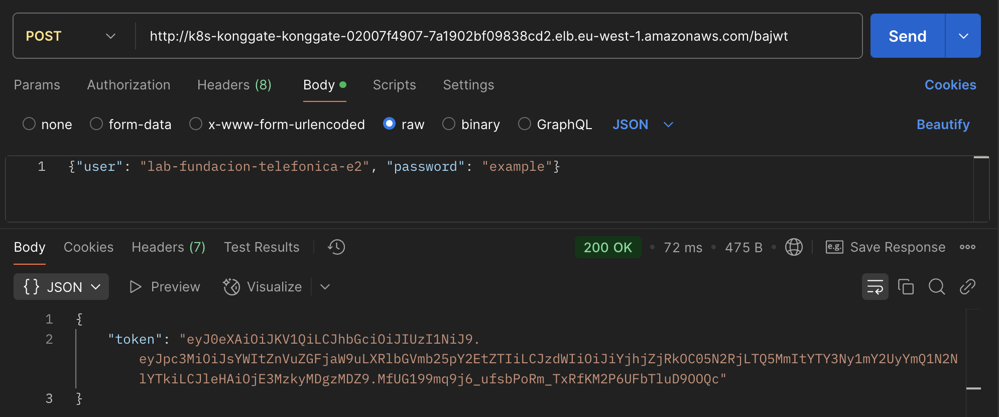

# **basic-auth-jwt Plugin for Kong**

## **Introduction**

Welcome to the **basic-auth-jwt** repository! 🎉  
This repository contains a **custom Kong plugin** designed to authenticate users representing employees of a company. 

### **Why this plugin?**
In some authentication scenarios, each **consumer** in Kong represents a company, and employees authenticate using **basic-auth** and **JWT credentials**. However, employees are identified with a specific naming convention where their username consists of the **company name + a suffix**.  

For example, if the company is `lab-fundacion-telefonica`, its employees will authenticate with usernames like:  
- `lab-fundacion-telefonica-e1`
- `lab-fundacion-telefonica-e2`
- ... and so on.

This plugin **extracts the base consumer name**, validates basic-auth credentials, retrieves JWT credentials, and returns a signed JWT token.

---

# **Plugin Documentation: basic-auth-jwt**

## **Overview**

The **basic-auth-jwt** plugin is designed to authenticate users representing employees of a company. In this scenario, each **consumer** in Kong represents a company, and each employee is identified using credentials (both basic-auth and JWT) where the `username` is the company name concatenated with a suffix. For example, if the consumer (company) is named `lab-fundacion-telefonica`, employees will be identified as:

- `lab-fundacion-telefonica-e1`
- `lab-fundacion-telefonica-e2`
- … and so on.

The suffix (e.g., `-e1`, `-e2`, etc.) is used to differentiate employees within the same company. During processing, the plugin extracts the base name of the consumer (the company) by removing the suffix, then queries and validates the associated credentials. However, the specific validation is performed against the credential corresponding to the employee (including the suffix).

---

## **Functionality and Processing Flow**

### **1. Request Reception and Processing**

- **Input:**  
  The plugin intercepts the request and expects a JSON body containing the following parameters:
  - `user`: A string identifying the employee, e.g., `"lab-fundacion-telefonica-e1"`.
  - `password`: The plain-text password.

- **Consumer Name Extraction:**  
  The suffix (e.g., `-e1`) is removed from the `user` value to obtain the base name of the consumer.  
  **Example:**  
  - Given `lab-fundacion-telefonica-e1`, the extracted base name is `lab-fundacion-telefonica`.

---

### **2. Basic Auth Credential Validation**

- **Querying the Kong Admin API for Basic Auth:**  
  An HTTP request is made to the following endpoint:
  `http://127.0.0.1:8001/consumers/<consumer_name>/basic-auth`

where `<consumer_name>` is the extracted base name (e.g., `lab-fundacion-telefonica`).

- **Search and Validation:**  
The list of basic-auth credentials returned is iterated over to find one where the `username` field exactly matches the original value received (including the suffix, e.g., `lab-fundacion-telefonica-e1`).  
For each candidate credential:
- The plain-text password is concatenated with the `consumer.id` (a process known as "salting").
- The SHA‑1 hash of the resulting value is computed and converted to a hexadecimal string.
- The computed hash is compared to the stored `password` field of the credential.
- If they match, validation is successful, and the `consumer.id` is stored.

---

### **3. JWT Token Generation**

- **Querying the Kong Admin API for JWT Credentials:**  
After validating the basic-auth credentials, the plugin queries the following endpoint:

  `http://127.0.0.1:8001/consumers/<consumer_name>/jwt`

to retrieve the JWT credentials associated with the consumer (company).

- **Finding the JWT Credential:**  
The list of JWT credentials is iterated over to find one where the `key` property exactly matches the original `user` (including the suffix, e.g., `lab-fundacion-telefonica-e1`).

- **Token Generation:**  
If the JWT credential is found:
- The `secret` from the credential is used to sign a JWT token using the **HS256** algorithm.
- The token is configured with:
  - `iss` (issuer): The `key` value (e.g., `lab-fundacion-telefonica-e1`).
  - `sub` (subject): The `consumer.id` obtained during basic-auth validation.
  - `exp` (expiration): Set to 1 hour (3600 seconds) from the issuance time.
- The generated JWT token is returned in the HTTP response.

- **If No JWT Credential is Found:**  
If no associated JWT credential is found (i.e., none exist with `key` equal to `lab-fundacion-telefonica-e1`), the plugin returns a **401 error** with the message:  
`"User does not have JWT associated"`, and the request **is not forwarded to the backend**.

---

### **4. Final Response**

- **If a JWT Token is Generated:**  
The plugin returns an HTTP **200 response** with the JWT token in the body (e.g., `{ "token": "<jwt_token>" }`).

- **If Basic Auth Validation Fails or No JWT Credential is Found:**  
An HTTP **401 response** is returned with an appropriate error message (e.g., `"Invalid credentials"` or `"User does not have JWT associated"`).

---

## **Security Considerations**

- **Salting and Hashing:**  
The password validation method applies salting by concatenating the plain-text password with the `consumer.id` before computing an SHA‑1 hash, following the same procedure as Kong’s built-in basic-auth plugin.

- **JWT Token Signing:**  
The JWT token is signed using the `secret` from the JWT credential with **HS256**, ensuring token integrity and validity.

- **Error Handling:**  
At each step, if an error occurs (e.g., user not found, invalid credentials, or missing JWT credential), the plugin immediately responds with the appropriate error code, preventing the request from being forwarded to the backend.

---

## **Summary**

- **Consumer vs. Employees:**  
- **Consumer (Company):** Represents the business entity (e.g., `lab-fundacion-telefonica`).
- **Employee:** Each employee is identified by a `username` consisting of the company name concatenated with a suffix (e.g., `-e1`, `-e2`, etc.). This suffix differentiates employees within the same consumer.

- **Processing Flow:**  
1. **Request Reception:** The plugin receives `user` (e.g., `lab-fundacion-telefonica-e1`) and `password`.
2. **Consumer Extraction:** The suffix is removed to obtain the company name (`lab-fundacion-telefonica`).
3. **Basic Auth Validation:** The Kong Admin API is queried to validate the basic-auth credentials, using salting and hashing for password verification.
4. **JWT Credential Lookup:** The Kong Admin API is queried to retrieve JWT credentials, searching for one where `key` matches `lab-fundacion-telefonica-e1`.
5. **Response Handling:**  
   - If a valid JWT credential is found, a signed JWT token is generated and returned.
   - Otherwise, a **401 error** is returned, indicating that the user does not have an associated JWT credential.

---

The username in basic authenthication and name of the key of jwt seed have to be the same with the final -e1,e2...

---

**This repository provides a robust authentication solution for Kong, ensuring seamless basic-auth and JWT token issuance for company employees.** 🚀
